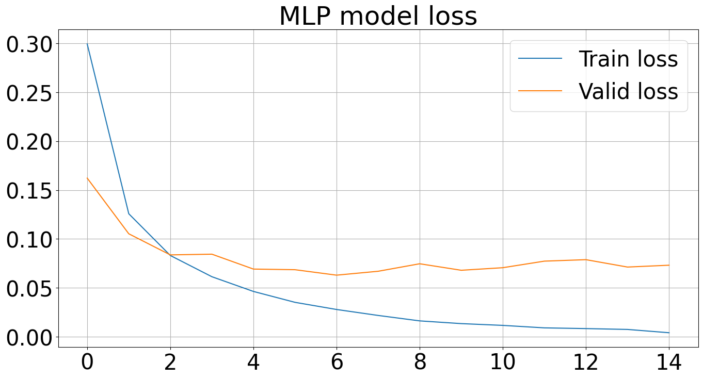

# MNIST_Neural_Network

Данный проект представляет из себя ноутбук, содержащий код для работы с изображениями и их обработки с использованием инструментов машинного обучения и компьютерного зрения.

## Структура проекта
| Файл/Папка          | Описание                             |
|---------------------|-------------------------------------|
| `mnist_conv2d.ipynb` | Основной ноутбук проекта             |
| `images/`           | Папка с изображениями для примеров   |
| `README.md`         | Документация проекта                 |


## Необходимые импорты библиотек:
```python
import warnings

import matplotlib.pyplot as plt
import numpy as np
import torch
import torch.nn as nn
import torchvision.transforms as T
from IPython.display import clear_output
from PIL import Image
from matplotlib import cm
from time import perf_counter
from torch.utils.data import DataLoader
from torchvision.datasets import MNIST
from tqdm import tqdm

warnings.filterwarnings('ignore')
```

## Основная структура ноутбука:

1. **Процесс загрузки изображения**
2. **Чтение изображения**
3. **Матричное представление (работа с цветами в пространстве RGB)**
4. **Основы свёртки**
5. **Применение пулинга**
6. **Изучение датасета MNIST** (разделение на тренировочную и валидационную части)
7. **Обучение полносвязной нейронной сети на датасете MNIST** (для сравнения со свёрточной)
8. **Обучение свёрточной сети**

**В ноутбуке также представлены все необходимые и удобные визуализации**

## Запуск проекта

1. Скачайте ноутбук из репозитория.
2. Убедитесь, что все зависимости установлены.
3. Запустите ноутбук с помощью Jupyter Notebook:

```bash
jupyter notebook mnist_conv2d.ipynb
```
4. Следуйте шагам внутри ноутбука для выполнения программы.

## Результаты

### График точности для свёрточной модели (CONV)


### График потерь для свёрточной модели (CONV)


### График точности для полносвязной модели (MLP)


### График потерь для полносвязной модели (MLP)


## Дополнительные материалы
- [Документация PyTorch](https://pytorch.org/docs/stable/index.html) — Официальная документация PyTorch, включая описание работы с моделями, оптимизаторами, загрузчиками данных и многим другим.
- [Документация torchvision.datasets.MNIST](https://pytorch.org/vision/stable/datasets.html#mnist) — Руководство по загрузке и работе с датасетом MNIST.